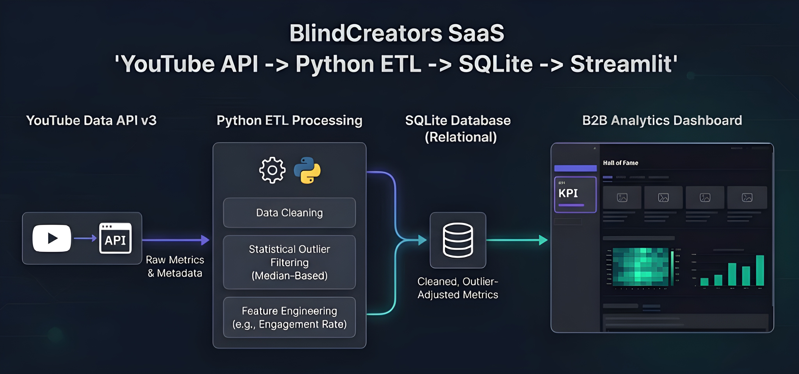
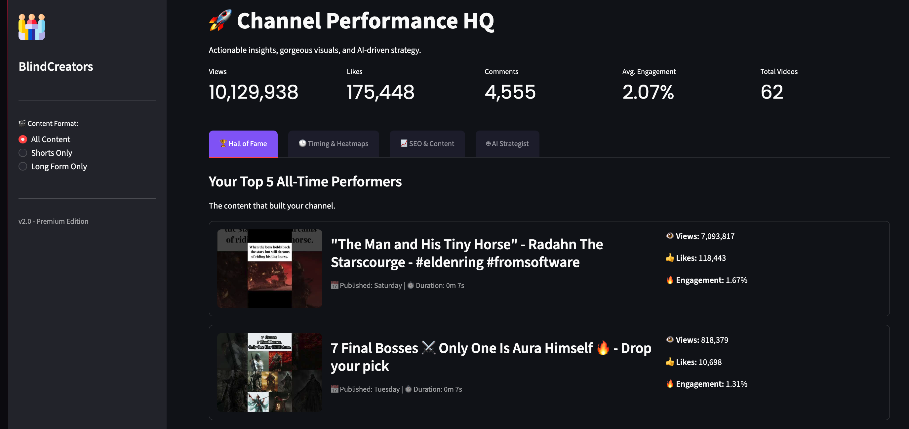

-----

## 📄 Final Documentation: README.md

markdown
# 👁️ BlindCreators: B2B AI-Driven Content Intelligence

> **Value Proposition**: A modular business intelligence ecosystem designed for high-performance content creators. It automates data ingestion from YouTube, performs statistical outlier-filtering, and leverages LLMs (Gemini 2.5 Flash) to transform raw metrics into actionable growth strategies.

---

## 📑 Table of Contents

1. [📂 Repository Structure](#-repository-structure)
2. [👥 Lead Developer](#-lead-developer)
3. [🏗️ System Architecture](#️-system-architecture)
4. [⚙️ Environment Requirements](#️-environment-requirements)
5. [🛠️ Modules & Execution](#️-modules--execution)
6. [🤖 AI Intelligence Layer](#-ai-intelligence-layer)
7. [📊 Visual Insights](#-visual-insights)
8. [🗓️ Strategic Roadmap (Sprints)](#️-strategic-roadmap-sprints)

---

## 📂 Repository Structure

```text
BlindCreators/
├── data/
│   ├── raw/                # JSON files (Audience comments, API dumps)
│   └── database.sqlite     # Relational storage for processed video metrics
├── src/
│   ├── extract.py          # YouTube Data API Ingestion engine
│   ├── transform.py        # Data cleaning & Feature Engineering
│   ├── load.py             # SQLite Persistence layer
│   ├── ai_assistant.py     # Gemini LLM Integration (RAG Pattern)
│   ├── extract_comments.py # NLP Data miner for audience sentiment
│   └── app.py              # Streamlit Premium Dashboard
├── .streamlit/
│   └── config.toml         # UI/UX Custom Branding (Slate & Indigo)
├── .env                    # Secure API Credentials (Ignored by Git)
├── requirements.txt        # Dependency Manifest
└── README.md               # Project Documentation
````

-----

## 👥 Lead Developer

  - **Pablo Martínez Suárez**
  - **GitHub**: https://github.com/pablomrtinezzz
  - **Status**: v0.1-beta (MVP Phase Completed)

-----

## 🏗️ System Architecture

BlindCreators follows a modern **ETL + RAG** (Retrieval-Augmented Generation) architecture:

1.  **Extraction**: Connects to YouTube Data API v3 to fetch public metrics and metadata.
2.  **Transformation**: Normalizes data and calculates "True Performance" by filtering viral outliers via Median Percentiles.
3.  **Audience Mining**: Extracts top-level comments and uses NLP to cluster audience needs.
4.  **AI Strategy**: Injects historical channel data into Gemini 2.5 Flash to generate context-aware SEO titles.

-----

## ⚙️ Environment Requirements

Before execution, ensure you have:

  * **Python 3.12+**
  * **YouTube Data API Key** (Google Cloud Console)
  * **Gemini API Key** (Google AI Studio)
  * **Virtual Environment** (`venv`) activated.

-----

## 🛠️ Modules & Execution

### 1\. Data Ingestion & ETL

To update the local database with the latest channel metrics:

```bash
python src/extract.py
```

### 2\. Audience Sentiment Mining

To download and prepare the latest top comments for AI analysis:

```bash
python src/extract_comments.py
```

### 3\. Business Intelligence Dashboard

To launch the premium analytical interface:

```bash
streamlit run src/app.py
```

-----

## 🤖 AI Intelligence Layer

BlindCreators utilizes **Gemini 2.5 Flash** for two critical B2B functions:

  * **SEO Optimizer**: Analyzes past top-performing titles to suggest 3 new high-CTR alternatives.
  * **Audience Miner**: Reads JSON comment dumps to identify content gaps and "Audience Pain Points."

-----

## 📊 Visual Insights & Diagrams


### Data Flow Overview


### Dashboard Preview


-----

## 🗓️ Strategic Roadmap (Sprints)

| Sprint | Goal | Status |
| :--- | :--- | :--- |
| **Sprint 1** | ETL Pipeline & Basic Dashboard | ✅ Done |
| **Sprint 2** | AI Integration (RAG) & Audience Miner | ✅ Done |
| **Sprint 3** | Professional Frontend (React + FastAPI) | 🗓️ Planned |
| **Sprint 4** | OAuth 2.0 & Private Analytics API | 🗓️ Planned |

-----

© 2026 BlindCreators - Pablo Martínez Suárez

